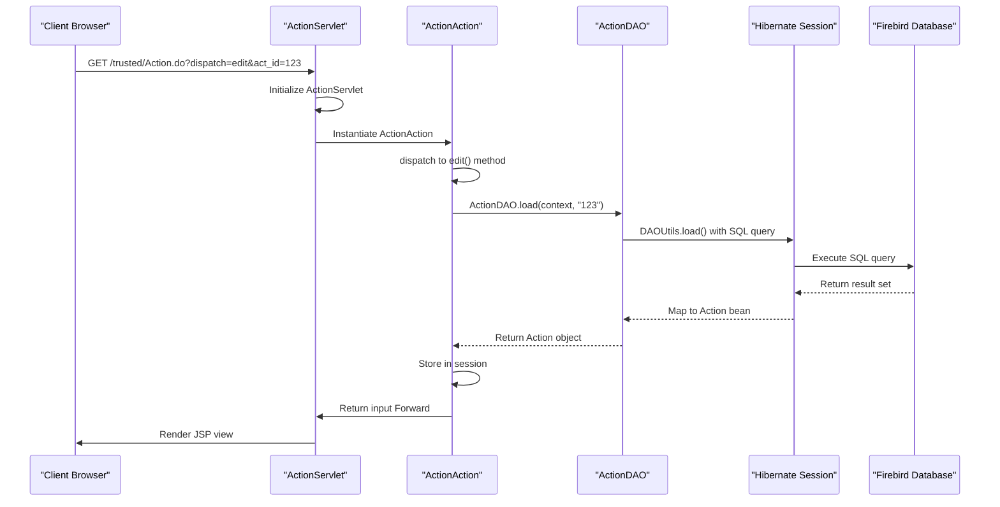
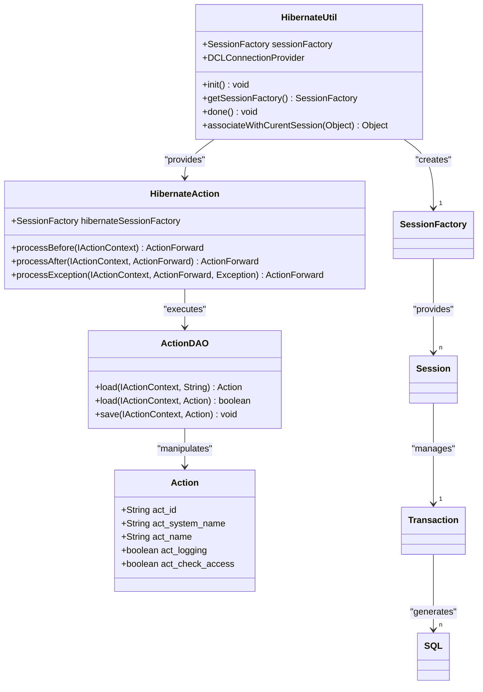
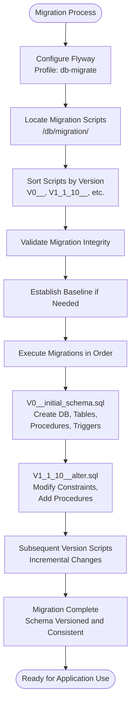
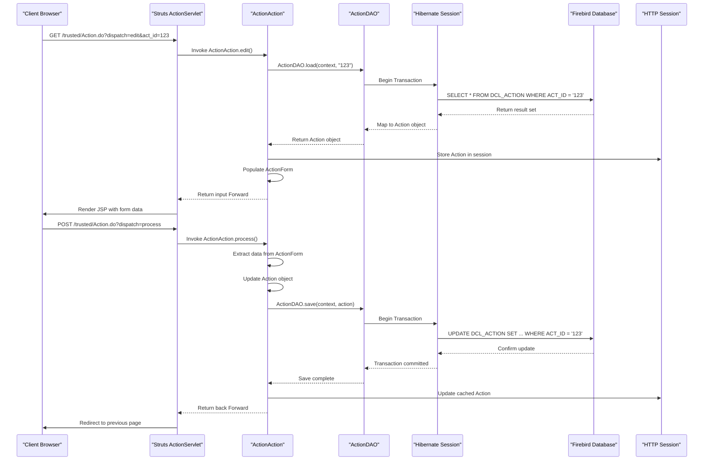

# Technology Stack

<cite>
**Referenced Files in This Document**   
- [pom.xml](file://pom.xml)
- [package.json](file://package.json)
- [hibernate.cfg.xml](file://src/main/resources/hibernate.cfg.xml)
- [web.xml](file://src/main/webapp/WEB-INF/web.xml)
- [HibernateUtil.java](file://src/main/java/net/sam/dcl/util/HibernateUtil.java)
- [HibernateAction.java](file://src/main/java/net/sam/dcl/controller/actions/HibernateAction.java)
- [ActionAction.java](file://src/main/java/net/sam/dcl/action/ActionAction.java)
- [ActionDAO.java](file://src/main/java/net/sam/dcl/dao/ActionDAO.java)
- [V0__initial_schema.sql](file://db/migration/V0__initial_schema.sql)
- [V1_1_10__alter.sql](file://db/migration/V1_1_10__alter.sql)
</cite>

## Table of Contents
1. [Java 8+ Backend Logic](#java-8-backend-logic)
2. [Struts 1.x MVC Framework](#struts-1x-mvc-framework)
3. [Hibernate 5.6 ORM with Firebird](#hibernate-56-orm-with-firebird)
4. [JSP Server-Side Rendering](#jsp-server-side-rendering)
5. [Flyway Database Migrations](#flyway-database-migrations)
6. [Build and Dependency Management](#build-and-dependency-management)
7. [Frontend Tooling with npm](#frontend-tooling-with-npm)
8. [Configuration Files](#configuration-files)
9. [Technology Integration Examples](#technology-integration-examples)
10. [Version Compatibility and Third-Party Dependencies](#version-compatibility-and-third-party-dependencies)
11. [Performance Considerations](#performance-considerations)
12. [Best Practices](#best-practices)

## Java 8+ Backend Logic

The dcl_v3 application utilizes Java 8+ as the foundation for all backend logic and business processing. The application is configured to compile with Java 8 source and target compatibility, as specified in the Maven configuration. Java 8 features such as lambda expressions, streams, and improved date/time APIs are available for use in the codebase, though the legacy nature of the application may limit their adoption. The backend logic is organized in a traditional Java EE pattern with packages for actions, beans, DAOs, forms, and utilities. The core application logic resides in the `net.sam.dcl` package hierarchy, with specific components separated into subpackages based on their responsibilities. The application leverages Java's object-oriented programming model extensively, with inheritance hierarchies for actions and controllers, and encapsulation of data in JavaBeans. The backend handles all business rules, data validation, and service orchestration, serving as the central processing unit between the presentation layer and data persistence layer.

**Section sources**
- [pom.xml](file://pom.xml#L15-L17)

## Struts 1.x MVC Framework

The dcl_v3 application implements the Model-View-Controller (MVC) architectural pattern using the Struts 1.x framework for request routing and controller management. Struts 1.x serves as the central routing mechanism, mapping incoming HTTP requests to appropriate action classes based on URL patterns ending with the `.do` extension. The framework is configured in the `web.xml` file with the `ActionServlet` servlet mapped to handle all `*.do` requests. This servlet serves as the front controller, receiving all incoming requests and delegating them to specific action classes based on the request URL and configuration defined in `struts-config.xml` (referenced in the web.xml configuration). The Struts framework provides a mature request processing lifecycle with distinct phases including form population, validation, action execution, and forward resolution. The application extends Struts' base classes with custom implementations such as `DBAction` and `HibernateAction` to provide database and Hibernate integration at the controller level. Action classes implement the `IDispatchable` interface to support method-level dispatching based on request parameters, allowing multiple operations to be handled within a single action class. The framework also supports Struts-specific features like action mappings, form beans, and declarative exception handling, which are integral to the application's request processing flow.

**Diagram sources **
- [web.xml](file://src/main/webapp/WEB-INF/web.xml#L85-L110)
- [ActionAction.java](file://src/main/java/net/sam/dcl/action/ActionAction.java)
- [ActionDAO.java](file://src/main/java/net/sam/dcl/dao/ActionDAO.java)

## Hibernate 5.6 ORM with Firebird

The dcl_v3 application uses Hibernate 5.6 as its Object-Relational Mapping (ORM) framework to bridge the gap between Java objects and the Firebird relational database. Hibernate is configured through the `hibernate.cfg.xml` file, which specifies the Firebird dialect, connection pool size, and various Hibernate properties. The configuration explicitly sets the `hibernate.dialect` property to `org.hibernate.dialect.FirebirdDialect`, ensuring optimal SQL generation for the Firebird database system. The application establishes a single `SessionFactory` instance through the `HibernateUtil` class, which is initialized at application startup and provides `CurrentSession` functionality for thread-safe session management. The `HibernateAction` base class integrates Hibernate with the Struts framework by automatically beginning transactions in the `processBefore` method and committing them in the `processAfter` method, providing declarative transaction management across action executions. The configuration enables the `ManagedSessionContext` for the current session context, allowing Hibernate to bind sessions to the current thread of execution. The application maps Java classes to database tables using Hibernate mappings defined in the configuration file, with over 70 entity classes mapped including `DboProduce`, `DboUser`, and `DboContract`. Additionally, the configuration references external HQL and native SQL resources, allowing for complex queries to be defined outside of Java code. The connection details are dynamically configured from the application's configuration system rather than being hardcoded in the Hibernate configuration, promoting environment-specific deployment flexibility.

**Diagram sources **
- [hibernate.cfg.xml](file://src/main/resources/hibernate.cfg.xml)
- [HibernateUtil.java](file://src/main/java/net/sam/dcl/util/HibernateUtil.java)
- [HibernateAction.java](file://src/main/java/net/sam/dcl/controller/actions/HibernateAction.java)

## JSP Server-Side Rendering

The dcl_v3 application employs JavaServer Pages (JSP) for server-side rendering of the user interface, providing dynamic content generation and template-based views. JSP files are located in the `src/main/webapp/jsp` directory and are organized by functional area, with over 150 JSP files serving various application views. The application leverages JSP 2.0+ features with UTF-8 encoding configured globally in the `web.xml` file through the `jsp-property-group` element, ensuring proper character encoding for internationalization. The JSPs extensively use the Struts tag libraries (`struts-bean`, `struts-html`, `struts-logic`, `struts-nested`, and `struts-tiles`) to create dynamic forms, iterate over collections, and conditionally render content based on application state. Additionally, the application defines custom tag libraries including `html-controls`, `dcl-html-controls`, and `html-grid` to encapsulate reusable UI components and simplify complex rendering logic. The JSPs follow a template-based approach with layout files in the `layout` directory that define common page structures, headers, footers, and navigation elements. The application uses a combination of JSP includes, tiles, and custom tags to promote code reuse and maintain consistency across views. Error handling is implemented through a dedicated `error.jsp` page that captures and displays exceptions with stack traces for debugging purposes. The JSPs are tightly integrated with the Struts framework, receiving form beans and other request attributes that are then rendered in the views, creating a seamless flow from controller to presentation.

**Section sources**
- [web.xml](file://src/main/webapp/WEB-INF/web.xml#L156-L174)
- [error.jsp](file://src/main/webapp/jsp/error.jsp)

## Flyway Database Migrations

The dcl_v3 application uses Flyway for database schema migration and version control, ensuring consistent database state across different environments. Flyway is configured as a Maven profile named `db-migrate` in the `pom.xml` file, allowing database migrations to be executed as a separate build step. The migration scripts are stored in the `db/migration` directory and follow Flyway's naming convention with version prefixes (e.g., `V1_1_10__alter.sql`). The application includes a comprehensive set of migration scripts, starting with `V0__initial_schema.sql` which contains the complete database schema definition, followed by numerous incremental alteration scripts that modify the schema over time. The Flyway configuration specifies the migration location as `filesystem:${project.basedir}/db/migration` and enables both `validateOnMigrate` and `baselineOnMigrate` to ensure schema integrity and support for existing databases. The initial schema script is extensive, defining generators, domains, tables, stored procedures, triggers, and constraints that form the foundation of the application's data model. Subsequent migration scripts, such as `V1_1_10__alter.sql`, demonstrate typical database evolution patterns including altering field nullability constraints and adding stored procedures for case-insensitive string operations. The migration approach allows for incremental database changes while maintaining a clear version history, supporting team development and deployment automation. The use of Flyway decouples database schema management from application code, enabling database changes to be version-controlled, reviewed, and tested independently of the Java codebase.

**Diagram sources **
- [pom.xml](file://pom.xml#L131-L168)
- [V0__initial_schema.sql](file://db/migration/V0__initial_schema.sql)
- [V1_1_10__alter.sql](file://db/migration/V1_1_10__alter.sql)

## Build and Dependency Management

The dcl_v3 application uses Apache Maven as its build and dependency management system, orchestrating compilation, packaging, and dependency resolution. The `pom.xml` file defines the project configuration with a WAR packaging type, indicating a web application that can be deployed to a servlet container. Maven manages dependencies for the application, including key libraries such as Struts, Hibernate, JUnit, and various utility packages. The dependency management approach uses explicit version declarations for all dependencies, ensuring reproducible builds and avoiding version conflicts. The build configuration includes multiple Maven profiles that support different development and deployment scenarios. The `db-migrate` profile enables Flyway database migrations, while the `legacy-run` profile configures the Jetty Maven plugin for running the application directly from the build environment. The build process is configured to skip compilation in certain stages, allowing for configuration-only deployments during migration phases. The Maven configuration also includes the Jetty plugin for embedded application server functionality, enabling developers to run the application without a separate deployment step. Dependency scopes are used appropriately, with servlet API dependencies marked as `provided` since they are supplied by the runtime container, while other libraries are included in the WAR file. The build system supports both development and production workflows, with configurations for testing, debugging, and deployment. The use of Maven provides a standardized build process that can be executed consistently across different development environments and continuous integration systems.

**Section sources**
- [pom.xml](file://pom.xml)

## Frontend Tooling with npm

The dcl_v3 application incorporates npm (Node Package Manager) for frontend tooling and testing, complementing the Java-based backend with modern JavaScript tooling. The `package.json` file defines the frontend dependencies and scripts, establishing npm as the package manager for client-side assets. The application uses Playwright, a modern end-to-end testing framework, for visual regression testing and automated browser testing. The npm configuration includes two primary scripts: `test:visual` for running visual tests and `test:visual:update` for updating snapshot references when intentional UI changes occur. These scripts leverage Playwright's capabilities to launch browsers, navigate through application pages, and compare screenshots against baseline images to detect unintended visual changes. The use of TypeScript (version 5.6.3) as a development dependency indicates that the frontend testing code is written in TypeScript, providing type safety and enhanced developer experience. This frontend tooling setup represents a modern approach to quality assurance, allowing the team to automate visual testing and catch UI regressions early in the development process. The integration of npm into a primarily Java-based application demonstrates a hybrid development approach that leverages the strengths of both ecosystems—the stability and maturity of Java for backend logic, and the rich tooling ecosystem of JavaScript/Node.js for frontend testing and automation.

**Section sources**
- [package.json](file://package.json)

## Configuration Files

The dcl_v3 application relies on several key configuration files to define its runtime behavior, database connectivity, and component integration. The `web.xml` deployment descriptor serves as the central configuration for the web application, defining servlets, filters, context parameters, and JSP settings. It configures the Struts `ActionServlet` as the front controller, mapping it to handle all `*.do` requests, and defines several custom filters including `HibernateSessionFilter`, `ResponseCollectFilter`, and `DefenderFilter` that intercept requests to manage Hibernate sessions, collect response data, and enforce security rules respectively. The `hibernate.cfg.xml` file configures the Hibernate ORM framework with database-specific settings, including the Firebird dialect, connection pool size, and entity mappings. This configuration file also enables SQL logging for debugging purposes and defines the session context class for thread-safe session management. The `pom.xml` file serves as the Maven build configuration, specifying project metadata, dependencies, build plugins, and profiles for different execution scenarios. Additionally, the application includes a `persistence.xml` file in the `META-INF` directory, which provides JPA configuration scaffolding for future migration to standard JPA interfaces. These configuration files work together to establish the application's runtime environment, with `web.xml` handling web container integration, `hibernate.cfg.xml` managing data persistence, and `pom.xml` orchestrating the build and deployment process. The separation of concerns across these configuration files follows established Java EE patterns, allowing different aspects of the application to be configured independently.

**Section sources**
- [web.xml](file://src/main/webapp/WEB-INF/web.xml)
- [hibernate.cfg.xml](file://src/main/resources/hibernate.cfg.xml)
- [pom.xml](file://pom.xml)

## Technology Integration Examples

The dcl_v3 application demonstrates tight integration between its various technology components, with well-defined patterns for how Struts actions interact with Hibernate DAOs and other services. A typical integration pattern can be observed in the `ActionAction` class, which extends `HibernateAction` and implements the `IDispatchable` interface. When a request is received for `/trusted/Action.do?dispatch=edit`, the Struts `ActionServlet` routes the request to the `ActionAction` class, which invokes the `edit` method. This method calls `ActionDAO.load(context, form.getAct_id())` to retrieve an Action entity from the database. The `ActionDAO` class uses `DAOUtils.load()` to execute a SQL query and map the results to an `Action` JavaBean. Throughout this process, the `HibernateAction` base class ensures that a Hibernate transaction is active, beginning in `processBefore` and committing in `processAfter`. The loaded `Action` object is stored in the user session via `StoreUtil.putSession()` and then populated into the `ActionForm` for display in the JSP view. When the user submits changes, the `process` method is invoked, which calls `saveCurrentFormToBean()` to update the `Action` object with form data, then calls `ActionDAO.save(context, action)` to persist the changes to the database. This integration pattern demonstrates how the application layers work together: Struts handles request routing and form management, the action class coordinates business logic, the DAO handles data access, and Hibernate manages the persistence transaction. The use of context objects (`IActionContext`) provides a consistent way to pass request, response, session, and other contextual information through the call stack, enabling the various components to access the information they need without tight coupling.

**Diagram sources **
- [ActionAction.java](file://src/main/java/net/sam/dcl/action/ActionAction.java)
- [ActionDAO.java](file://src/main/java/net/sam/dcl/dao/ActionDAO.java)
- [HibernateAction.java](file://src/main/java/net/sam/dcl/controller/actions/HibernateAction.java)

## Version Compatibility and Third-Party Dependencies

The dcl_v3 application maintains a carefully managed set of third-party dependencies with specific version requirements to ensure stability and compatibility. The core technology stack consists of Java 8, Struts 1.x, Hibernate 5.6, and Firebird database, representing a mature but aging combination of technologies. The Maven `pom.xml` file explicitly defines dependency versions, including Struts (implied by the servlet API version), Hibernate 5.6.15.Final, and various supporting libraries. The application uses servlet-api 4.0.1 and jsp-api 2.3.3, which are technically compatible with Java EE 8 specifications, though the application itself follows older Java EE patterns. The logging stack is built on SLF4J 2.0.13 with Logback 1.4.14 as the implementation, providing a flexible logging facade with bridges for commons-logging and log4j to ensure all components use the same logging system. The database connectivity relies on Hibernate's built-in connection provider with custom extensions in the `DCLConnectionProvider` class that sets user context via a stored procedure call. The application also includes JSTL 1.2 for additional JSP tag functionality. For testing, the application uses Playwright 1.48.0 with TypeScript 5.6.3, representing more modern frontend testing tools integrated with the legacy application. The version choices reflect a balance between maintaining compatibility with the existing codebase and incorporating reasonably recent versions of supporting libraries for security and performance improvements. The use of Maven profiles allows for different dependency configurations in different scenarios, such as including H2 database for testing while relying on Firebird for production.

**Section sources**
- [pom.xml](file://pom.xml)

## Performance Considerations

The dcl_v3 application incorporates several performance considerations in its technology stack and implementation patterns, while also presenting areas for potential optimization. The Hibernate configuration includes settings that impact performance, such as a connection pool size of 10, which provides reasonable concurrency without excessive resource consumption. The application uses Hibernate's `ManagedSessionContext` for current session management, reducing the overhead of session creation and ensuring thread safety. The `hibernate.show_sql` property is enabled in the configuration, which is useful for development and debugging but should be disabled in production to avoid logging overhead. The application follows a pattern of transaction demarcation at the action level, with transactions beginning before action processing and committing after, which provides data consistency but may result in longer transaction durations than necessary. The use of eager loading for certain entity associations, as suggested by the numerous mapped classes in `hibernate.cfg.xml`, could lead to performance issues with large result sets if not carefully managed. The Struts framework's request processing lifecycle, while mature and stable, introduces overhead compared to more modern web frameworks. The JSP-based rendering approach, with extensive use of custom tags and includes, may impact page generation performance, particularly for complex views. The application could benefit from implementing caching strategies, particularly for reference data that doesn't change frequently. Database performance is supported by the use of stored procedures for complex operations, as evidenced in the migration scripts, which can be more efficient than equivalent SQL generated by Hibernate. The use of Flyway for database migrations also contributes to performance by ensuring database schema optimizations and index creation are applied consistently across environments.

**Section sources**
- [hibernate.cfg.xml](file://src/main/resources/hibernate.cfg.xml)
- [HibernateAction.java](file://src/main/java/net/sam/dcl/controller/actions/HibernateAction.java)

## Best Practices

The dcl_v3 application implements several best practices in its technology stack and architecture, while also presenting opportunities for modernization. The application follows the principle of separation of concerns by clearly delineating responsibilities between the presentation (JSP), control (Struts actions), and data access (DAO) layers. The use of Maven for build automation and dependency management represents a best practice in software development, ensuring reproducible builds and simplified dependency resolution. The inclusion of Flyway for database migrations follows modern practices for database version control, allowing schema changes to be tracked, reviewed, and deployed systematically. The application's configuration strategy, with externalized configuration files rather than hardcoded values, supports deployment to different environments without code changes. The use of filters in `web.xml` to manage cross-cutting concerns like Hibernate session management and request/response setup demonstrates an understanding of aspect-oriented programming principles. The application implements proper error handling with dedicated error pages and exception logging, improving maintainability and debuggability. The integration of automated testing tools like Playwright for visual regression testing represents a commitment to quality assurance. However, the application could benefit from several modernization best practices, including migrating from Struts 1.x to a more modern web framework, adopting dependency injection to reduce coupling, implementing comprehensive unit and integration testing, and considering a gradual migration to more modern Java features and patterns. The application's architecture also suggests opportunities for introducing service layers between controllers and DAOs to better encapsulate business logic.

**Section sources**
- [pom.xml](file://pom.xml)
- [web.xml](file://src/main/webapp/WEB-INF/web.xml)
- [package.json](file://package.json)