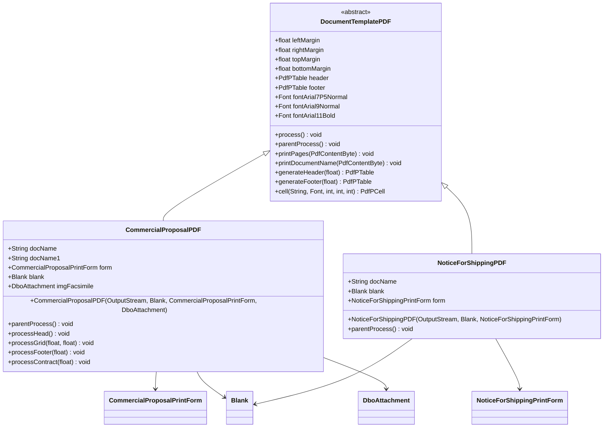
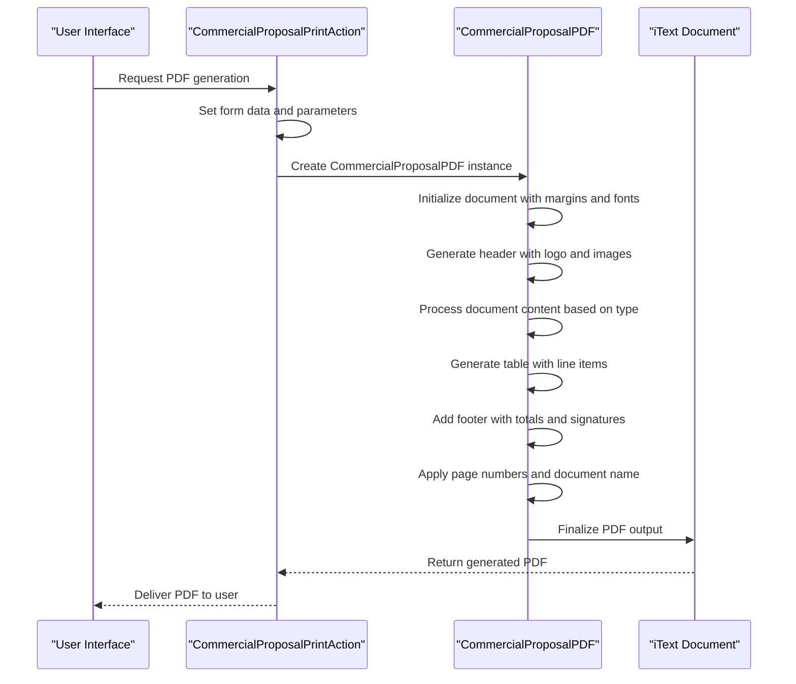

# Document Generation Testing

<cite>
**Referenced Files in This Document**   
- [CommercialProposalPDF.java](file://src/main/java/net/sam/dcl/report/pdf/CommercialProposalPDF.java)
- [DocumentTemplatePDF.java](file://src/main/java/net/sam/dcl/report/pdf/DocumentTemplatePDF.java)
- [HelloWorldPDF.java](file://src/main/java/net/sam/dcl/test/pdf/HelloWorldPDF.java)
- [Blank.java](file://src/main/java/net/sam/dcl/beans/Blank.java)
- [CommercialProposalPrintForm.java](file://src/main/java/net/sam/dcl/form/CommercialProposalPrintForm.java)
- [NoticeForShippingPDF.java](file://src/main/java/net/sam/dcl/report/pdf/NoticeForShippingPDF.java)
</cite>

## Table of Contents
1. [Introduction](#introduction)
2. [PDF Generation Architecture](#pdf-generation-architecture)
3. [Testing PDF Layout and Formatting](#testing-pdf-layout-and-formatting)
4. [Content Accuracy Verification](#content-accuracy-verification)
5. [Dynamic Content Generation Testing](#dynamic-content-generation-testing)
6. [Document Comparison and Golden Files](#document-comparison-and-golden-files)
7. [Security and Compliance Testing](#security-and-compliance-testing)
8. [Testing Strategies and Best Practices](#testing-strategies-and-best-practices)

## Introduction
The dcl_v3 system generates various business documents including commercial proposals, contracts, and shipping documents in PDF format. This documentation focuses on testing the PDF generation functionality, with HelloWorldPDF.java serving as a foundational example for understanding the PDF generation process. The system uses the iText library (referred to as lowagie.text in the codebase) to create PDF documents with precise formatting, layout, and content requirements. Testing must ensure that generated documents meet business requirements for accuracy, formatting, and compliance.

**Section sources**
- [HelloWorldPDF.java](file://src/main/java/net/sam/dcl/test/pdf/HelloWorldPDF.java#L1-L63)

## PDF Generation Architecture
The PDF generation system in dcl_v3 follows an object-oriented architecture with a base DocumentTemplatePDF class that provides common functionality for all document types. Specific document classes like CommercialProposalPDF extend this base class to implement document-specific formatting and content. The architecture separates concerns between document structure, content generation, and styling, allowing for consistent formatting across different document types while enabling customization for specific business needs.

**Diagram sources **
- [DocumentTemplatePDF.java](file://src/main/java/net/sam/dcl/report/pdf/DocumentTemplatePDF.java#L1-L442)
- [CommercialProposalPDF.java](file://src/main/java/net/sam/dcl/report/pdf/CommercialProposalPDF.java#L1-L982)
- [NoticeForShippingPDF.java](file://src/main/java/net/sam/dcl/report/pdf/NoticeForShippingPDF.java#L1-L44)

**Section sources**
- [DocumentTemplatePDF.java](file://src/main/java/net/sam/dcl/report/pdf/DocumentTemplatePDF.java#L1-L442)
- [CommercialProposalPDF.java](file://src/main/java/net/sam/dcl/report/pdf/CommercialProposalPDF.java#L1-L982)

## Testing PDF Layout and Formatting
Testing PDF layout and formatting in dcl_v3 requires verifying multiple aspects of document presentation. The system uses precise margin settings, font specifications, and table formatting to ensure professional-looking documents. Key testing areas include:

### Page Layout and Margins
The DocumentTemplatePDF base class defines standard margins (left: 50, right: 25, top: 30, bottom: 20) that are inherited by all document types. Contract documents have reduced top and bottom margins (5 points) compared to standard documents (15 points). Tests should verify that these margin settings are consistently applied and that content does not overflow page boundaries.

### Font Rendering and Styling
The system uses Arial font at various sizes (7.5pt, 9pt, 10pt, 11pt) with normal, bold, and underlined styles. Font rendering tests should verify:
- Correct font family (Arial) is used throughout
- Appropriate font sizes for different content types (headers, body text, footers)
- Proper application of bold and normal weights
- Consistent character encoding (specified by Blank.getBln_charset())

### Table Formatting
Tables are a critical component of business documents, particularly for displaying line items in commercial proposals and contracts. The AutoWidthsTable class handles dynamic column width calculation based on content. Tests should verify:
- Proper column alignment (left, center, right as appropriate)
- Consistent cell padding and spacing
- Correct application of borders (particularly the BOX border style)
- Handling of multi-line content in cells
- Proper column width distribution and text wrapping

### Image Embedding
The system supports embedding images in document headers, footers, and as facsimiles. The addImage method in DocumentTemplatePDF handles image scaling and positioning. Tests should verify:
- Correct loading of images from configured directories (img-head.dir, img-logo.dir)
- Proper scaling of images to fit designated areas
- Appropriate border styling around images
- Correct positioning of logo and header/footer images

**Section sources**
- [DocumentTemplatePDF.java](file://src/main/java/net/sam/dcl/report/pdf/DocumentTemplatePDF.java#L1-L442)
- [CommercialProposalPDF.java](file://src/main/java/net/sam/dcl/report/pdf/CommercialProposalPDF.java#L1-L982)
- [AutoWidthsTable.java](file://src/main/java/net/sam/dcl/report/pdf/AutoWidthsTable.java#L1-L60)

## Content Accuracy Verification
Ensuring content accuracy in generated PDFs is critical for business operations. The system must correctly populate document fields with data from business entities and forms.

### Template-Based Content Generation
The system uses message keys (e.g., "rep.CommercialProposal.number1") to retrieve localized text from resource bundles. Tests should verify that:
- Correct message keys are used for different document types (commercial proposal, invoice, contract)
- Message parameters are properly substituted (document number, date, user information)
- Russian language text is correctly rendered using the specified character encoding

### Page Numbering and Document Naming
Page numbering is implemented through the printPages method, which displays "Страница [current_page] из [XXX]" (Page [current_page] of [XXX]). Document-specific variations exist for contracts. Tests should verify:
- Correct page number display in document footer
- Accurate total page count
- Proper document naming in the footer (docName and docName1 fields)
- Consistent formatting of page numbers and document names

### Watermark Application
The PageNumbersWatermark example demonstrates watermark functionality, including:
- Text watermarks with transparency (starting from page 3)
- Image watermarks with rotation
- Orange border around pages
Tests should verify that watermark functionality works as expected when implemented in production documents, including proper positioning, transparency, and conditional application based on page number.

### Field Content Validation
The CommercialProposalPrintForm contains numerous fields that must be accurately reflected in the generated PDF. Tests should verify that:
- Contractor and contact person information is correctly displayed
- Financial data (totals, currency, VAT) is accurately presented
- Delivery and payment terms are properly formatted
- Conditional content (based on isInvoice, isContract flags) appears only when appropriate

**Diagram sources **
- [CommercialProposalPrintAction.java](file://src/main/java/net/sam/dcl/action/CommercialProposalPrintAction.java#L34-L71)
- [CommercialProposalPDF.java](file://src/main/java/net/sam/dcl/report/pdf/CommercialProposalPDF.java#L1-L982)

**Section sources**
- [CommercialProposalPDF.java](file://src/main/java/net/sam/dcl/report/pdf/CommercialProposalPDF.java#L1-L982)
- [CommercialProposalPrintForm.java](file://src/main/java/net/sam/dcl/form/CommercialProposalPrintForm.java#L1-L47)
- [PageNumbersWatermark.java](file://src/main/java/net/sam/dcl/test/pdf/PageNumbersWatermark.java#L1-L156)

## Dynamic Content Generation Testing
The system supports dynamic content generation based on business rules and user input. Testing must verify that conditional content appears correctly and that dynamic formatting is applied appropriately.

### Conditional Sections
The CommercialProposalPDF class implements several conditional sections based on document type and business rules:
- Different document titles and headers for commercial proposals, invoices, and contracts
- Conditional display of executor information based on isPrintExecutor flag
- Different payment and delivery terms based on prepayPercent value
- Conditional inclusion of facsimile images

Tests should verify that these conditional sections appear only when their conditions are met and that the correct content is displayed for each condition.

### Currency Formatting
The system handles currency formatting for financial data in commercial proposals and contracts. Tests should verify:
- Proper formatting of monetary values with appropriate decimal places
- Correct currency symbols and names
- Accurate calculation and display of totals, VAT, and discounts
- Proper handling of different currencies (BYN and others)

The ValidatorFieldCheck class provides validation for currency values, ensuring they fall within acceptable ranges. Tests should verify that currency validation works correctly and that invalid values are properly handled.

### Conditional Text Generation
The system generates different text blocks based on business rules, such as:
- Different contract terms based on prepayment percentage (100%, 0%, or other)
- Conditional footer text based on assembleMinsk flag
- Dynamic delivery terms based on providerDelivery flag

Tests should verify that the correct text variants are generated for each business scenario and that message parameters are properly substituted.

**Section sources**
- [CommercialProposalPDF.java](file://src/main/java/net/sam/dcl/report/pdf/CommercialProposalPDF.java#L1-L982)
- [ValidatorFieldCheck.java](file://src/main/java/net/sam/dcl/util/ValidatorFieldCheck.java#L45-L181)

## Document Comparison and Golden Files
To ensure consistency and detect regressions, the system should implement document comparison testing using golden files.

### Golden File Strategy
Create a set of golden PDF files that represent the expected output for various document types and scenarios. These golden files should cover:
- Standard commercial proposal
- Invoice version of commercial proposal
- Contract version of commercial proposal
- Shipping documents
- Documents with facsimile images
- Documents in different languages

### Automated Comparison
Implement automated comparison of generated PDFs against golden files using techniques such as:
- Text extraction and comparison to verify content accuracy
- Layout analysis to verify positioning and formatting
- Image comparison for headers, footers, and logos
- Metadata comparison (author, title, subject)

The HelloWorldPDF example demonstrates basic PDF generation that could be extended to create test fixtures for comparison testing.

### Regression Testing
Establish a regression testing suite that:
- Generates PDFs for all document types with standard test data
- Compares generated PDFs against golden files
- Reports differences in content, layout, or formatting
- Flags any deviations for manual review

This approach ensures that changes to the PDF generation code do not introduce unintended changes to document appearance or content.

**Section sources**
- [HelloWorldPDF.java](file://src/main/java/net/sam/dcl/test/pdf/HelloWorldPDF.java#L1-L63)
- [CommercialProposalPDF.java](file://src/main/java/net/sam/dcl/report/pdf/CommercialProposalPDF.java#L1-L982)

## Security and Compliance Testing
Business documents must meet security and compliance requirements to protect sensitive information and ensure legal validity.

### Document Metadata
Test that generated PDFs include appropriate metadata such as:
- Author and creator information
- Document title and subject
- Creation and modification dates
- Keywords for document classification

The system should ensure that metadata does not contain sensitive information and is consistent with organizational standards.

### Accessibility Compliance
Verify that generated PDFs meet accessibility standards by:
- Including proper document structure (headings, paragraphs)
- Providing alternative text for images
- Ensuring sufficient color contrast
- Supporting screen reader navigation
- Using logical reading order

### Document Security
Test any security features implemented in the PDF generation process, such as:
- Password protection
- Usage restrictions (printing, copying, editing)
- Digital signatures
- Encryption

The system should ensure that security features do not interfere with legitimate document usage while protecting sensitive information.

**Section sources**
- [CommercialProposalPDF.java](file://src/main/java/net/sam/dcl/report/pdf/CommercialProposalPDF.java#L1-L982)
- [DocumentTemplatePDF.java](file://src/main/java/net/sam/dcl/report/pdf/DocumentTemplatePDF.java#L1-L442)

## Testing Strategies and Best Practices
Effective testing of PDF document generation requires a comprehensive approach that combines automated testing with manual verification.

### Test Data Management
Create comprehensive test data sets that cover:
- Various document types (commercial proposals, contracts, shipping documents)
- Different business scenarios (full prepayment, partial prepayment, no prepayment)
- Edge cases (long text fields, special characters, empty fields)
- Internationalization scenarios (different languages, character encodings)

### Automated Testing Framework
Implement an automated testing framework that:
- Generates PDFs programmatically using test data
- Extracts text content for verification
- Analyzes document structure and layout
- Compares against golden files
- Reports test results with detailed diagnostics

### Visual Regression Testing
Supplement automated tests with visual regression testing to catch layout issues that may not be detected by text-based comparison. This could involve:
- Converting PDFs to images for pixel-by-pixel comparison
- Using specialized tools to detect layout changes
- Manual review of visual differences

### Performance Testing
Evaluate the performance of PDF generation under various conditions:
- Large documents with many line items
- High concurrent request loads
- Generation of multiple documents in batch
- Memory usage during document generation

### Integration Testing
Test PDF generation as part of end-to-end business processes:
- Creating a commercial proposal and generating the PDF
- Converting a commercial proposal to a contract
- Generating shipping documents from orders
- Verifying that document generation integrates correctly with authentication and authorization

These testing strategies ensure that the PDF generation functionality in dcl_v3 produces accurate, properly formatted, and compliant documents that meet business requirements.

**Section sources**
- [CommercialProposalPDF.java](file://src/main/java/net/sam/dcl/report/pdf/CommercialProposalPDF.java#L1-L982)
- [DocumentTemplatePDF.java](file://src/main/java/net/sam/dcl/report/pdf/DocumentTemplatePDF.java#L1-L442)
- [HelloWorldPDF.java](file://src/main/java/net/sam/dcl/test/pdf/HelloWorldPDF.java#L1-L63)