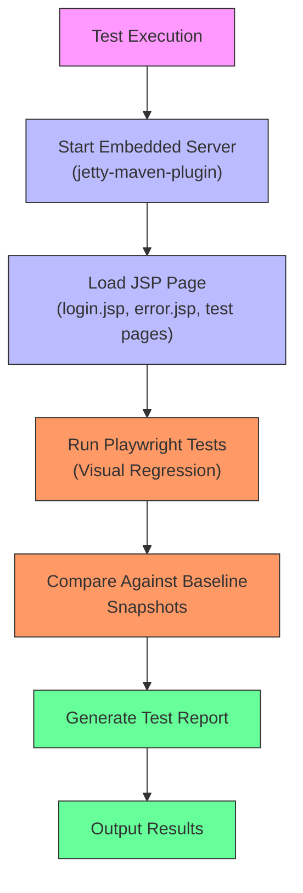
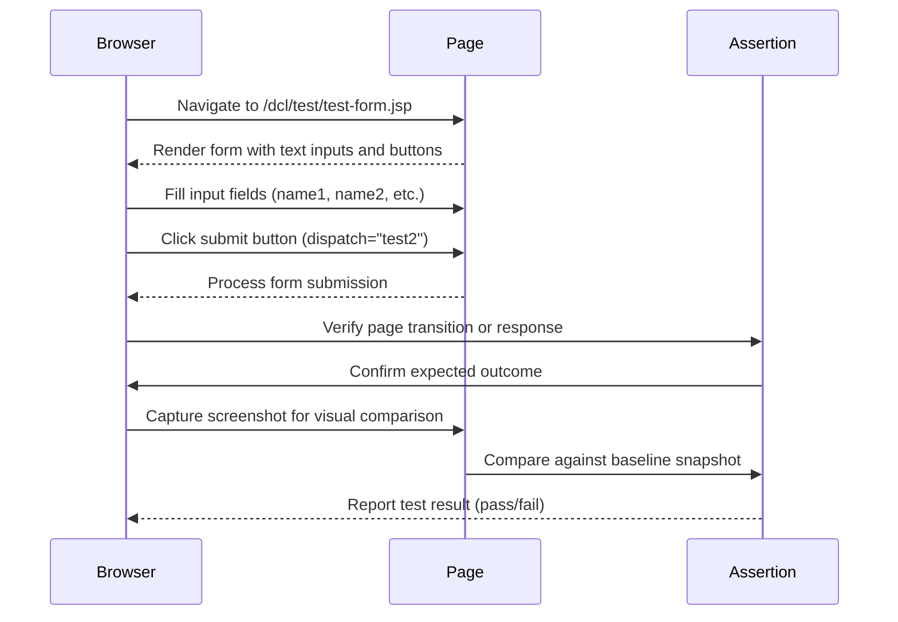

# End-to-End Testing

<cite>
**Referenced Files in This Document**   
- [package.json](file://package.json)
- [MIGRATION_STEPS.md](file://MIGRATION_STEPS.md)
- [src/main/webapp/test/test-form.jsp](file://src/main/webapp/test/test-form.jsp)
- [src/main/webapp/test/grid.jsp](file://src/main/webapp/test/grid.jsp)
- [src/main/webapp/test/test.html](file://src/main/webapp/test/test.html)
- [src/main/webapp/jsp/login.jsp](file://src/main/webapp/jsp/login.jsp)
- [src/main/webapp/jsp/error.jsp](file://src/main/webapp/jsp/error.jsp)
</cite>

## Table of Contents
1. [Introduction](#introduction)
2. [Test Setup and Configuration](#test-setup-and-configuration)
3. [Execution Workflows](#execution-workflows)
4. [Writing Browser Automation Tests](#writing-browser-automation-tests)
5. [Test Environment Configuration](#test-environment-configuration)
6. [Debugging and Reporting](#debugging-and-reporting)
7. [CI/CD Integration](#cicd-integration)
8. [Best Practices](#best-practices)

## Introduction
The dcl_v3 application implements a Playwright-based end-to-end testing framework specifically designed to validate the JSP frontend through realistic user interaction simulations. This documentation provides comprehensive guidance on the testing infrastructure, covering setup, configuration, execution workflows, and best practices for maintaining reliable visual and functional tests. The framework is currently configured for visual regression testing, with plans to expand coverage to key JSP pages that render without database dependencies.

**Section sources**
- [package.json](file://package.json#L0-L12)
- [MIGRATION_STEPS.md](file://MIGRATION_STEPS.md#L131-L138)

## Test Setup and Configuration
The Playwright testing framework in dcl_v3 is configured through npm scripts defined in the package.json file. The test infrastructure is specifically designed for visual regression testing, with configuration managed through a dedicated Playwright configuration file. The framework targets the JSP frontend, requiring a running server instance to render pages for testing.

The current configuration includes two primary scripts:
- `test:visual`: Executes visual tests using the configuration specified in ./tests/visual/playwright.config.ts
- `test:visual:update`: Runs visual tests with the snapshot update flag enabled, allowing baseline images to be refreshed

According to the migration documentation, the test environment requires an embedded server (planned to be jetty-maven-plugin or cargo/tomcat7-maven-plugin) to render JSP pages for baseline capture. The testing strategy focuses initially on key JSPs that can render without database connectivity, such as login.jsp, error.jsp, and various test pages.

**Diagram sources**
- [package.json](file://package.json#L0-L12)
- [MIGRATION_STEPS.md](file://MIGRATION_STEPS.md#L131-L138)

**Section sources**
- [package.json](file://package.json#L0-L12)
- [MIGRATION_STEPS.md](file://MIGRATION_STEPS.md#L131-L138)

## Execution Workflows
The Playwright test execution workflow in dcl_v3 follows a structured process designed for visual regression testing of JSP pages. Tests are executed through npm scripts that invoke the Playwright test runner with specific configuration options.

The primary execution commands are:
- `npm run test:visual`: Runs the visual test suite against the current application state, comparing rendered pages against established baseline snapshots
- `npm run test:visual:update`: Executes tests while updating the baseline snapshots, used when intentional UI changes have been made

The execution workflow requires the application server to be running, as Playwright needs to access rendered JSP pages. The migration documentation indicates that this will be accomplished using an embedded server plugin (jetty-maven-plugin or cargo/tomcat7-maven-plugin) that can be started as part of the test process.

The test scope currently targets JSP pages that can render without database connectivity, including:
- Authentication pages (login.jsp)
- Error handling pages (error.jsp)
- Test pages (test-form.jsp, grid.jsp, test.html)
- Other static or minimally dynamic JSPs

This approach allows for reliable visual regression testing without the complexity of database setup and data seeding.

**Section sources**
- [package.json](file://package.json#L0-L12)
- [MIGRATION_STEPS.md](file://MIGRATION_STEPS.md#L131-L138)
- [src/main/webapp/test/test-form.jsp](file://src/main/webapp/test/test-form.jsp)
- [src/main/webapp/test/grid.jsp](file://src/main/webapp/test/grid.jsp)
- [src/main/webapp/test/test.html](file://src/main/webapp/test/test.html)
- [src/main/webapp/jsp/login.jsp](file://src/main/webapp/jsp/login.jsp)
- [src/main/webapp/jsp/error.jsp](file://src/main/webapp/jsp/error.jsp)

## Writing Browser Automation Tests
When writing browser automation tests for the dcl_v3 application, focus on simulating real user interactions with the JSP frontend. Tests should validate both functional behavior and visual presentation, ensuring that pages render correctly and respond appropriately to user actions.

For page navigation, tests should:
- Navigate to specific JSP pages using their URLs
- Verify page title and key elements are present
- Check for proper rendering of page components and layout

For form submission testing:
- Locate form elements by their properties or dispatch attributes
- Fill in input fields with test data
- Submit forms using buttons or links with dispatch attributes
- Verify successful submission and appropriate page transitions

Example test patterns include:
- Navigating to test-form.jsp and interacting with text inputs and submit buttons
- Testing grid functionality on grid.jsp with various grid operations
- Validating basic HTML page rendering on test.html

Assertion patterns should include:
- Visual regression comparisons against baseline snapshots
- Element presence checks for key page components
- Text content verification for static elements
- URL validation after navigation or form submission
- Response status code verification

**Diagram sources**
- [src/main/webapp/test/test-form.jsp](file://src/main/webapp/test/test-form.jsp)
- [src/main/webapp/test/grid.jsp](file://src/main/webapp/test/grid.jsp)

**Section sources**
- [src/main/webapp/test/test-form.jsp](file://src/main/webapp/test/test-form.jsp#L0-L19)
- [src/main/webapp/test/grid.jsp](file://src/main/webapp/test/grid.jsp#L0-L56)

## Test Environment Configuration
The test environment for dcl_v3 requires specific configuration to support Playwright-based end-to-end testing of JSP pages. The framework is designed to work with an embedded server that can render JSP content without requiring a full production database setup.

Key configuration requirements include:
- **Server Configuration**: Implementation of jetty-maven-plugin or cargo/tomcat7-maven-plugin to serve JSP pages during testing
- **Browser Support**: Playwright's default browser support (Chromium, Firefox, and WebKit) for cross-browser testing
- **Headless Execution**: Default headless mode for CI/CD environments, with option for headed execution during test development
- **Test Scope**: Focus on JSP pages that can render without database dependencies

The environment should be configured to:
- Start the embedded server automatically when tests are executed
- Serve static and dynamic JSP content at the appropriate context path
- Handle basic authentication if required for test pages
- Provide stable URLs for test navigation

The configuration should also support different execution modes:
- **Development Mode**: Headed browser execution with slow motion and detailed logging
- **CI/CD Mode**: Headless execution with parallel test running and comprehensive reporting
- **Visual Regression Mode**: High-fidelity screenshot capture and comparison

**Section sources**
- [MIGRATION_STEPS.md](file://MIGRATION_STEPS.md#L131-L138)
- [package.json](file://package.json#L0-L12)

## Debugging and Reporting
Effective debugging and reporting are essential for maintaining reliable end-to-end tests in the dcl_v3 application. The Playwright framework provides several mechanisms for diagnosing test failures and understanding test execution.

For debugging failed tests:
- Enable headed browser mode to visually observe test execution
- Use Playwright's trace viewer to record and analyze test runs
- Implement strategic breakpoints and step-through execution
- Examine console logs and network requests for errors

For capturing diagnostic information:
- Configure automatic screenshot capture on test failure
- Enable video recording of test sessions
- Preserve browser console logs and network traces
- Generate detailed HTML test reports with execution timelines

The visual testing approach inherently provides excellent debugging capabilities, as differences between current and baseline snapshots are visually apparent. When a visual test fails, developers can immediately see exactly what has changed in the UI.

Reporting should include:
- Summary of test results (pass/fail/skip counts)
- Detailed failure information with screenshots
- Execution time metrics
- Browser and environment information
- Links to trace files for further analysis

**Section sources**
- [package.json](file://package.json#L0-L12)
- [MIGRATION_STEPS.md](file://MIGRATION_STEPS.md#L131-L138)

## CI/CD Integration
Integrating the Playwright end-to-end tests into CI/CD pipelines is a critical step in ensuring application quality. The migration documentation specifically mentions creating a CI job to start the server and run visual tests.

The CI/CD integration should:
- Execute as part of the build process after successful compilation
- Start the embedded server (jetty-maven-plugin) before test execution
- Run tests in headless mode for efficiency
- Generate comprehensive test reports
- Fail the build on test failures to prevent regressions

Key considerations for CI/CD integration:
- **Environment Consistency**: Ensure test environments match production as closely as possible
- **Test Parallelization**: Run tests in parallel to reduce execution time
- **Artifact Preservation**: Save test reports, screenshots, and videos as build artifacts
- **Flakiness Management**: Implement retry mechanisms for flaky tests while monitoring for patterns
- **Baseline Management**: Establish clear processes for updating visual baselines

The CI pipeline should be configured to:
1. Build the application
2. Start the embedded JSP server
3. Execute Playwright visual tests
4. Generate and publish test reports
5. Stop the server
6. Report results back to the development team

**Section sources**
- [MIGRATION_STEPS.md](file://MIGRATION_STEPS.md#L131-L138)
- [package.json](file://package.json#L0-L12)

## Best Practices
To maintain reliable and effective end-to-end tests in the dcl_v3 application, follow these best practices:

**Test Design Principles**
- Focus on user journeys rather than isolated component testing
- Prioritize high-value, high-risk functionality
- Keep tests independent and isolated
- Use descriptive test names that clearly indicate purpose
- Follow the page object pattern for maintainability

**Visual Testing Specifics**
- Establish clear baselines for all visual tests
- Review and approve baseline updates carefully
- Test at multiple viewport sizes if responsive design is important
- Exclude dynamic content (timestamps, counters) from visual comparisons
- Regularly review and update baselines as UI evolves

**Maintenance and Reliability**
- Regularly review and refactor tests to match application changes
- Monitor for flaky tests and address root causes
- Keep tests up to date with UI changes
- Remove obsolete tests that no longer provide value
- Document test purpose and scope

**Performance Considerations**
- Run tests in parallel when possible
- Use appropriate wait strategies instead of fixed timeouts
- Minimize test setup and teardown time
- Consider selective test execution for rapid feedback
- Optimize screenshot capture and storage

**Team Collaboration**
- Establish clear ownership of test suites
- Document test conventions and patterns
- Review test changes in code reviews
- Share test insights with the development team
- Use test failures as opportunities to improve application quality

Following these best practices will ensure that the Playwright end-to-end tests remain a valuable asset for maintaining the quality and reliability of the dcl_v3 application.

**Section sources**
- [package.json](file://package.json#L0-L12)
- [MIGRATION_STEPS.md](file://MIGRATION_STEPS.md#L131-L138)
- [src/main/webapp/test/test-form.jsp](file://src/main/webapp/test/test-form.jsp)
- [src/main/webapp/test/grid.jsp](file://src/main/webapp/test/grid.jsp)