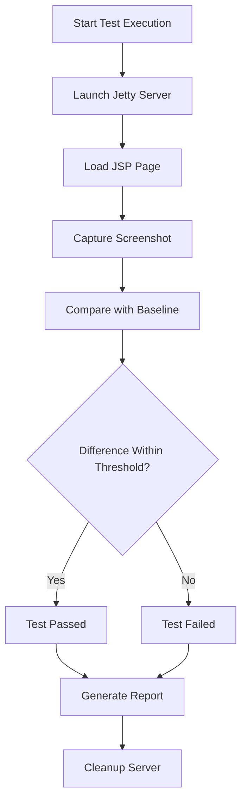
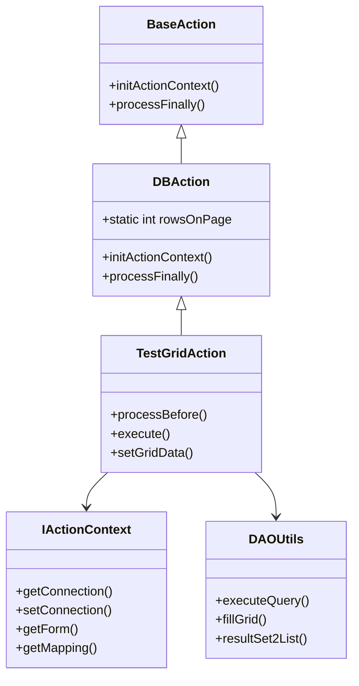
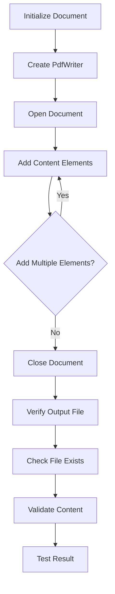
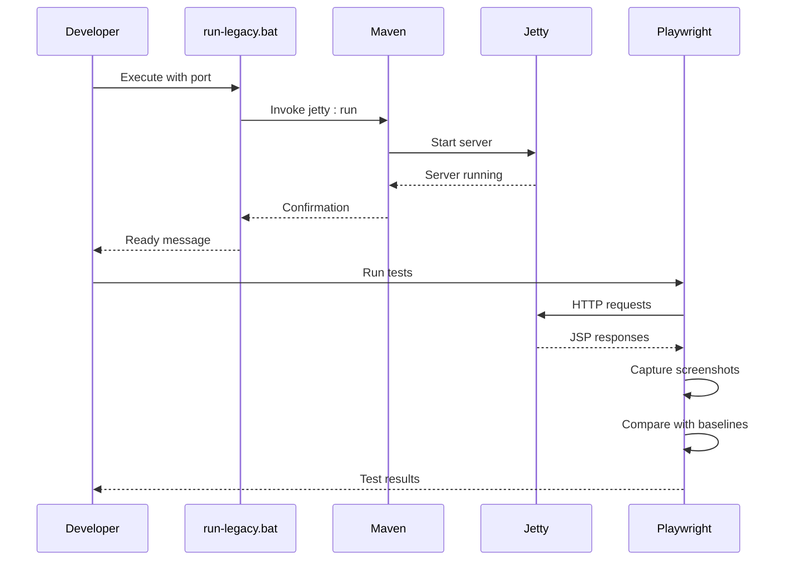

# Testing & Quality Assurance

<cite>
**Referenced Files in This Document**   
- [package.json](file://package.json)
- [pom.xml](file://pom.xml)
- [TestGridAction.java](file://src/main/java/net/sam/dcl/test/TestGridAction.java)
- [HelloWorldPDF.java](file://src/main/java/net/sam/dcl/test/pdf/HelloWorldPDF.java)
- [MIGRATION_STEPS.md](file://MIGRATION_STEPS.md)
- [run-legacy.bat](file://run-legacy.bat)
</cite>

## Table of Contents
1. [Introduction](#introduction)
2. [End-to-End Testing with Playwright](#end-to-end-testing-with-playwright)
3. [Unit and Integration Testing Framework](#unit-and-integration-testing-framework)
4. [PDF Generation Testing](#pdf-generation-testing)
5. [Test Organization and Execution Workflows](#test-organization-and-execution-workflows)
6. [Reporting Mechanisms](#reporting-mechanisms)
7. [Writing and Running Test Cases](#writing-and-running-test-cases)
8. [Test Coverage Goals](#test-coverage-goals)
9. [Mocking Strategies](#mocking-strategies)
10. [Continuous Integration Considerations](#continuous-integration-considerations)

## Introduction
The dcl_v3 application employs a comprehensive testing strategy that combines end-to-end visual testing with Playwright, unit and integration testing using JUnit-based frameworks, and specialized testing for PDF document generation. The quality assurance practices are designed to ensure the stability and reliability of the legacy Java web application during modernization efforts. This documentation provides a detailed overview of the testing infrastructure, execution workflows, and best practices for maintaining code quality.

## End-to-End Testing with Playwright

The dcl_v3 application implements end-to-end visual testing using Playwright, a modern testing framework for web applications. This approach captures visual baselines of key JSP pages and compares them against expected outputs to detect unintended UI changes.

The Playwright testing configuration is defined in the package.json file, which specifies two primary scripts:
- `test:visual`: Executes visual tests using the Playwright configuration
- `test:visual:update`: Updates snapshot baselines when intentional UI changes occur

Visual testing is integrated with an embedded Jetty server that renders JSP pages without requiring a full database connection. This allows testing of static pages such as login.jsp, error.jsp, and various test pages. The testing infrastructure is designed to work with GitHub Actions CI, where server startup and test execution are automated.

The visual testing strategy follows a threshold-based approach with initial settings of 0.3% pixel ratio difference and a maximum of 200 different pixels allowed. This balances sensitivity to meaningful changes while accommodating minor rendering variations across environments.

**Diagram sources**
- [package.json](file://package.json#L1-L12)
- [pom.xml](file://pom.xml#L103-L133)
- [MIGRATION_STEPS.md](file://MIGRATION_STEPS.md#L131-L138)

**Section sources**
- [package.json](file://package.json#L1-L12)
- [MIGRATION_STEPS.md](file://MIGRATION_STEPS.md#L33-L42)

## Unit and Integration Testing Framework

The dcl_v3 application utilizes a custom unit and integration testing framework built on Java, with test classes organized in the src/main/java/net/sam/dcl/test package. The framework follows a pattern of action-based testing, where specific controller actions and form handlers are tested in isolation.

Key test classes include:
- TestGridAction.java: Tests grid-based UI components and pagination functionality
- TestForm.java: Validates form data binding and validation logic
- Various Test*Action and Test*Form classes for specific application features

The testing framework integrates with the application's Struts-based MVC architecture, allowing tests to simulate user interactions with action controllers and form handlers. TestGridAction.java demonstrates this approach by implementing a DBAction that extends BaseAction, providing access to the application's database connection management and action processing pipeline.

Test classes validate both the business logic and data flow within the application, ensuring that controller actions properly process form data, interact with the database, and return appropriate navigation results. The framework leverages the application's existing DAOUtils for database operations, allowing integration tests to verify data access patterns and query execution.

**Diagram sources**
- [TestGridAction.java](file://src/main/java/net/sam/dcl/test/TestGridAction.java#L1-L68)
- [DBAction.java](file://src/main/java/net/sam/dcl/controller/actions/DBAction.java#L1-L36)
- [BaseDispatchValidatorForm.java](file://src/main/java/net/sam/dcl/controller/BaseDispatchValidatorForm.java#L1-L52)

**Section sources**
- [TestGridAction.java](file://src/main/java/net/sam/dcl/test/TestGridAction.java#L1-L68)
- [TestForm.java](file://src/main/java/net/sam/dcl/test/TestForm.java#L1-L54)

## PDF Generation Testing

The dcl_v3 application includes specialized testing for PDF document generation, implemented in the src/main/java/net/sam/dcl/test/pdf package. This testing ensures that generated PDF documents maintain the correct format, content, and layout required by business processes.

The HelloWorldPDF.java class serves as a foundational example of PDF generation testing, demonstrating how to create and verify PDF output using the iText library (referred to as "lowagie" in the code). The test generates a simple "Hello World" document with various text elements, including paragraphs with different formatting and scaling.

PDF testing in dcl_v3 focuses on verifying:
- Correct document structure and page layout
- Proper text rendering and formatting
- Accurate content generation
- Consistent output across executions

The testing approach involves generating PDF files to disk and validating their content programmatically. While HelloWorldPDF.java provides a basic example, other test classes in the pdf package (such as AddBigTable.java, MyFirstTable.java, and NestedTables.java) demonstrate more complex scenarios involving tables, measurements, and multi-page layouts.

**Diagram sources**
- [HelloWorldPDF.java](file://src/main/java/net/sam/dcl/test/pdf/HelloWorldPDF.java#L1-L62)
- [AddBigTable.java](file://src/main/java/net/sam/dcl/test/pdf/AddBigTable.java)
- [MyFirstTable.java](file://src/main/java/net/sam/dcl/test/pdf/MyFirstTable.java)

**Section sources**
- [HelloWorldPDF.java](file://src/main/java/net/sam/dcl/test/pdf/HelloWorldPDF.java#L1-L62)

## Test Organization and Execution Workflows

The dcl_v3 testing infrastructure is organized into distinct categories based on testing type and purpose. Tests are structured to support both development-time validation and continuous integration workflows.

The project uses Maven as the primary build and test orchestration tool, with testing capabilities extended through npm and Playwright for visual testing. The pom.xml configuration includes profiles for different testing scenarios, including:
- legacy-run: For running the application with test configurations
- orm-smoke: For isolated ORM smoke tests
- db-migrate: For database migration testing

Test execution workflows are designed to be flexible and adaptable to different environments. The run-legacy.bat script provides a convenient way to start the Jetty server for testing, accepting an optional port parameter. This script configures the necessary Java module opens for legacy libraries on modern JVMs and sets the appropriate Maven profile.

For visual testing, the workflow involves:
1. Starting the embedded Jetty server
2. Executing Playwright tests against the running server
3. Comparing captured screenshots with baseline images
4. Generating test reports

The testing infrastructure is designed to work in both local development environments and CI/CD pipelines, with GitHub Actions configured to run visual tests as part of the build process.

**Diagram sources**
- [pom.xml](file://pom.xml#L238-L282)
- [run-legacy.bat](file://run-legacy.bat#L1-L34)
- [package.json](file://package.json#L1-L12)

**Section sources**
- [pom.xml](file://pom.xml#L69-L282)
- [run-legacy.bat](file://run-legacy.bat#L1-L34)

## Reporting Mechanisms

The dcl_v3 application's testing framework incorporates several reporting mechanisms to provide visibility into test results and quality metrics. While the core Java tests do not generate formal reports, the Playwright visual testing system produces comprehensive output.

Visual test reports include:
- Screenshot comparisons highlighting differences
- Summary statistics on pixel differences
- Pass/fail status for each test case
- Execution time metrics

The reporting infrastructure is integrated with the CI/CD pipeline, where test results are attached as artifacts for further analysis. This allows development teams to review test outcomes, investigate failures, and track quality trends over time.

For local development, test results are displayed in the console output, with detailed information about any visual differences detected. The threshold-based comparison system helps reduce false positives by allowing minor rendering variations while still catching significant layout changes.

The testing approach emphasizes actionable feedback, ensuring that developers can quickly identify and address issues. Baseline images are managed as artifacts rather than being committed to version control, allowing teams to update baselines when intentional UI changes occur.

## Writing and Running Test Cases

Creating new test cases in the dcl_v3 application follows established patterns for both unit/integration tests and visual tests. The process involves understanding the existing test structure and adhering to the application's architectural patterns.

To create a new unit or integration test:
1. Identify the component or action to be tested
2. Create a test class extending the appropriate base class (e.g., DBAction)
3. Implement test methods that simulate user interactions
4. Use DAOUtils for database operations when needed
5. Validate expected outcomes and navigation results

For visual tests using Playwright:
1. Identify the JSP page to be tested
2. Create a new spec file in the tests/visual/specs directory
3. Configure the test to navigate to the target page
4. Capture screenshots for comparison
5. Update baselines using the test:visual:update script

To execute the test suite:
- For visual tests: `npm run test:visual` (runs tests) or `npm run test:visual:update` (updates baselines)
- For Java tests: Use Maven with the appropriate profile (e.g., `mvn -P legacy-run test`)
- For local server testing: `run-legacy.bat [port]` to start the server, then run tests against it

When interpreting results, developers should:
- Review visual test reports for screenshot differences
- Check console output for error messages
- Verify that all test cases pass according to the defined thresholds
- Update baselines when intentional UI changes have been made

## Test Coverage Goals

The dcl_v3 testing strategy establishes clear coverage goals to ensure comprehensive validation of the application's functionality. These goals are designed to balance thoroughness with practicality, focusing on critical business functionality and high-risk areas.

Key coverage objectives include:
- Core user workflows and navigation paths
- Critical business logic in action controllers
- Data access patterns and database interactions
- PDF document generation for key reports
- Visual consistency of essential UI components

The visual testing framework specifically targets JSP pages that render without requiring database connections, such as:
- login.jsp: Authentication interface
- error.jsp: Error handling and display
- Various test pages: Development and debugging interfaces

Coverage is prioritized based on business impact and change frequency, with higher coverage required for core functionality that directly affects users and business processes. The threshold-based visual testing system allows teams to maintain coverage while accommodating minor rendering differences across environments.

## Mocking Strategies

The dcl_v3 application employs several mocking and test isolation strategies to ensure reliable and repeatable test execution. These strategies are particularly important for testing components that depend on external systems or complex data states.

For database interactions, the testing framework leverages the application's existing VDbConnectionManager and DAOUtils classes, which provide a layer of abstraction over direct database access. This allows tests to work with the database connection management system without requiring complex mocking infrastructure.

The embedded Jetty server configuration in the pom.xml file includes support for test-scoped dependencies, allowing the use of H2 in-memory databases for certain test scenarios. This enables integration tests to verify data access patterns without impacting production data.

For visual testing, the strategy focuses on testing pages that render without database dependencies, effectively "mocking" the data layer by using static content. This approach ensures that visual tests are stable and not affected by data changes.

The DBAction class demonstrates a form of dependency injection by setting up the VDbConnection in the initActionContext method and cleaning it up in processFinally, making it easier to control database connections during testing.

## Continuous Integration Considerations

The dcl_v3 testing infrastructure is designed with continuous integration in mind, leveraging GitHub Actions for automated test execution. The CI pipeline includes dedicated jobs for visual testing, ensuring that UI changes are caught early in the development process.

Key CI considerations include:
- Node.js toolchain setup for Playwright execution
- Caching of node_modules to improve build performance
- Artifact storage for test reports and baseline images
- Threshold-based comparison to prevent flaky failures
- Integration with the Maven build process

The CI workflow is configured to run visual tests after the build job, ensuring that only successfully built applications are tested. Test results are attached as artifacts, allowing team members to review failures and verify fixes.

To mitigate risks in the CI environment:
- The testing infrastructure avoids committing baseline images to version control
- Thresholds are set to accommodate minor rendering differences
- Fallback options are available for environments where Node.js is not installed
- The repository size is managed to prevent performance issues

The continuous integration strategy supports the modernization of the legacy application by providing automated feedback on code changes, helping to maintain stability while enabling incremental improvements.