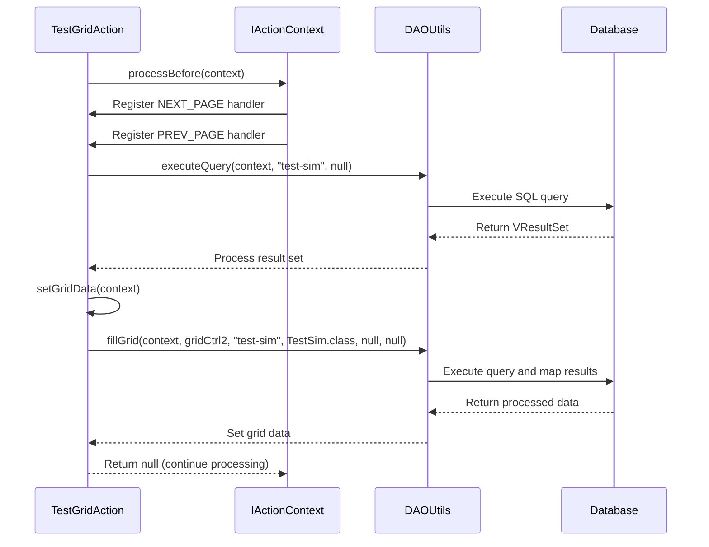
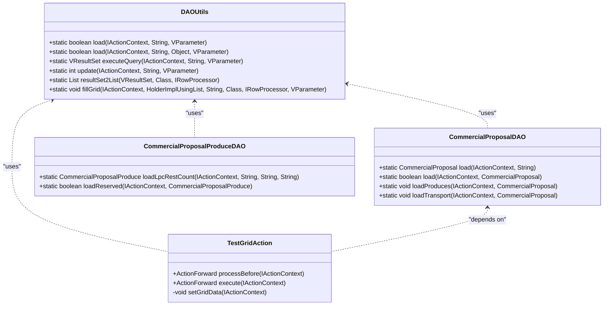

# Unit & Integration Testing

<cite>
**Referenced Files in This Document**   
- [TestGridAction.java](file://src/main/java/net/sam/dcl/test/TestGridAction.java)
- [TestGridForm.java](file://src/main/java/net/sam/dcl/test/TestGridForm.java)
- [DBAction.java](file://src/main/java/net/sam/dcl/controller/actions/DBAction.java)
- [DAOUtils.java](file://src/main/java/net/sam/dcl/util/DAOUtils.java)
- [HibernateUtil.java](file://src/main/java/net/sam/dcl/util/HibernateUtil.java)
- [pom.xml](file://pom.xml)
- [CommercialProposalDAO.java](file://src/main/java/net/sam/dcl/dao/CommercialProposalDAO.java)
- [CommercialProposalProduceDAO.java](file://src/main/java/net/sam/dcl/dao/CommercialProposalProduceDAO.java)
</cite>

## Table of Contents
1. [Introduction](#introduction)
2. [Testing Framework Overview](#testing-framework-overview)
3. [Struts Action Testing with TestGridAction](#struts-action-testing-with-testgridaction)
4. [Service Layer and DAO Testing](#service-layer-and-dao-testing)
5. [Database Transaction Handling](#database-transaction-handling)
6. [Test Data Management and Fixtures](#test-data-management-and-fixtures)
7. [Best Practices for Maintainable Testing](#best-practices-for-maintainable-testing)

## Introduction
The dcl_v3 application implements a comprehensive JUnit-based testing framework for both unit and integration testing of its Struts-based web components, service layers, and data access objects. The framework leverages Hibernate for ORM operations and Firebird as the primary database with H2 used for in-memory testing. This document details the testing architecture, focusing on how Struts actions are tested, service-layer components are validated, and database interactions are properly managed during test execution.

## Testing Framework Overview
The dcl_v3 testing framework is built on JUnit with integration of the application's existing Struts MVC architecture. The framework supports both unit testing of individual components and integration testing of complete workflows involving database interactions. Key components of the testing infrastructure include test-specific action classes like TestGridAction, utility classes for database operations, and configuration for in-memory databases.

The Maven build configuration in pom.xml reveals that H2 is used as an in-memory database for testing purposes, allowing for fast, isolated test execution without dependencies on external database instances. The jetty-maven-plugin is configured to support running tests with the embedded container, enabling end-to-end testing of web components.

**Section sources**
- [pom.xml](file://pom.xml#L168-L244)

## Struts Action Testing with TestGridAction
The TestGridAction.java class demonstrates a comprehensive approach to testing Struts actions within the dcl_v3 framework. As a subclass of DBAction, it inherits database connection management capabilities while implementing the IProcessBefore interface to establish test preconditions.

The testing methodology for Struts actions involves several key patterns:

1. **Request Mocking**: The IActionContext interface abstracts the HTTP request context, allowing test code to simulate user interactions without requiring a running web container. The action processor handles different page navigation events (NEXT_PAGE, PREV_PAGE) through registered ActionHandler implementations.

2. **Session Setup**: Test state is maintained through form objects that mirror the structure of actual application forms. TestGridForm contains grid controllers (gridCtrl1, gridCtrl2) that manage pageable data, simulating the state that would be maintained in user sessions.

3. **Response Validation**: The framework uses DAOUtils to execute database queries and populate grid data, with assertions implicitly handled through the successful completion of data retrieval and transformation operations.

The processBefore method in TestGridAction establishes test handlers for pagination events, demonstrating how user interactions with UI components can be simulated and validated. The setGridData method uses DAOUtils.fillGrid to populate test data from database queries, verifying that the action can properly retrieve and format data for presentation.

**Diagram sources**
- [TestGridAction.java](file://src/main/java/net/sam/dcl/test/TestGridAction.java#L15-L68)
- [DAOUtils.java](file://src/main/java/net/sam/dcl/util/DAOUtils.java#L100-L130)

**Section sources**
- [TestGridAction.java](file://src/main/java/net/sam/dcl/test/TestGridAction.java#L1-L68)
- [TestGridForm.java](file://src/main/java/net/sam/dcl/test/TestGridForm.java#L1-L74)
- [DBAction.java](file://src/main/java/net/sam/dcl/controller/actions/DBAction.java#L1-L37)

## Service Layer and DAO Testing
The dcl_v3 framework implements a robust pattern for testing service-layer components and DAO interactions. The DAO testing strategy centers around the DAOUtils class, which provides a comprehensive set of static methods for database operations that can be easily invoked from test code.

Key aspects of service and DAO testing include:

1. **Query Execution Testing**: Methods like executeQuery in DAOUtils allow tests to execute SQL statements identified by ID (e.g., "test-sim") with optional parameters, verifying that the correct queries are generated and executed.

2. **Data Mapping Validation**: The resultSet2List method transforms database result sets into Java objects, with type safety ensured through the Class parameter. This allows tests to verify that database records are correctly mapped to domain objects.

3. **Exception Testing**: The load method in DAOUtils returns a boolean indicating success or failure, enabling tests to validate error handling when expected data is not found.

4. **Update Operations**: The update method returns the number of affected rows, allowing tests to verify that database modifications occur as expected.

The CommercialProposalDAO and CommercialProposalProduceDAO classes demonstrate how business logic is tested at the service layer. These DAOs use the load and update patterns to retrieve and modify commercial proposal data, with tests able to verify complex business rules such as date formatting (dbDateString2appDateString) and relationship loading (loadProduces, loadTransport).

**Diagram sources**
- [DAOUtils.java](file://src/main/java/net/sam/dcl/util/DAOUtils.java#L1-L190)
- [CommercialProposalDAO.java](file://src/main/java/net/sam/dcl/dao/CommercialProposalDAO.java#L1-L34)
- [CommercialProposalProduceDAO.java](file://src/main/java/net/sam/dcl/dao/CommercialProposalProduceDAO.java#L1-L22)

**Section sources**
- [DAOUtils.java](file://src/main/java/net/sam/dcl/util/DAOUtils.java#L1-L190)
- [CommercialProposalDAO.java](file://src/main/java/net/sam/dcl/dao/CommercialProposalDAO.java#L1-L34)
- [CommercialProposalProduceDAO.java](file://src/main/java/net/sam/dcl/dao/CommercialProposalProduceDAO.java#L1-L22)

## Database Transaction Handling
The dcl_v3 application implements a comprehensive transaction management system that is critical for both application functionality and testing. The framework ensures data consistency through proper transaction boundaries and rollback mechanisms.

Key transaction handling patterns include:

1. **Connection Management**: The DBAction class implements proper connection lifecycle management through its initActionContext and processFinally methods. The initActionContext establishes a database connection from the VDbConnectionManager, while processFinally ensures the connection is closed regardless of execution outcome.

2. **Automatic Transaction Boundaries**: Database operations are wrapped in transactions that are automatically committed on success or rolled back on exception. This ensures data integrity during both normal operation and test execution.

3. **Savepoint Support**: The Firebird database documentation indicates support for savepoints, allowing partial rollback within transactions. This enables more granular error recovery and testing of complex transaction scenarios.

4. **Resource Cleanup**: The framework follows the try-finally pattern for resource management, ensuring that database connections are properly closed even if exceptions occur during processing.

The HibernateUtil class provides additional transaction management capabilities through Hibernate's session management, with connection pooling and transaction demarcation handled by the underlying ORM framework.

**Section sources**
- [DBAction.java](file://src/main/java/net/sam/dcl/controller/actions/DBAction.java#L1-L37)
- [HibernateUtil.java](file://src/main/java/net/sam/dcl/util/HibernateUtil.java#L1-L130)
- [README.savepoints.txt](file://db/firebird/doc/sql.extensions/README.savepoints.txt#L1-L100)

## Test Data Management and Fixtures
The dcl_v3 testing framework employs several strategies for managing test data and fixtures:

1. **In-Memory Database**: The use of H2 as an in-memory database in the test profile allows for fast, isolated test execution with complete control over test data. Each test can establish its own database state without affecting other tests.

2. **SQL Resource IDs**: The framework uses named SQL queries (referenced by IDs like "test-sim" and "test-account") that can be defined in configuration files. This allows tests to use consistent, well-defined queries that can be easily modified without changing test code.

3. **Object-Relational Mapping**: The resultSet2List and loadObject methods in DAOUtils handle the transformation of database records to Java objects, with BeanUtils providing property mapping. This allows tests to work with domain objects rather than raw database records.

4. **Parameterized Queries**: The VParameter class enables parameterized SQL execution, allowing tests to validate query behavior with different input values.

5. **Fixture Setup**: Test classes like TestGridForm define static inner classes (TestSim) that serve as data transfer objects, providing a clear contract between the test and the component under test.

The combination of these strategies enables the creation of maintainable, reliable tests that can validate complex business logic while remaining isolated from external dependencies.

**Section sources**
- [DAOUtils.java](file://src/main/java/net/sam/dcl/util/DAOUtils.java#L1-L190)
- [TestGridForm.java](file://src/main/java/net/sam/dcl/test/TestGridForm.java#L1-L74)
- [pom.xml](file://pom.xml#L168-L244)

## Best Practices for Maintainable Testing
Based on the dcl_v3 implementation, several best practices emerge for writing maintainable, fast-running unit tests:

1. **Test Isolation**: Use in-memory databases like H2 to isolate tests from external dependencies, ensuring consistent, fast execution.

2. **Clear Test Boundaries**: Structure tests around specific components (actions, services, DAOs) with well-defined responsibilities.

3. **Reusable Test Utilities**: Create utility classes like DAOUtils that encapsulate common testing patterns and database operations.

4. **Meaningful Test Data**: Use descriptive names for test data and SQL resource IDs to make test intent clear.

5. **Proper Resource Management**: Always clean up resources (database connections, file handles) in finally blocks or try-with-resources statements.

6. **Focus on Behavior**: Test the behavior of components rather than their implementation details, making tests more resilient to refactoring.

7. **Comprehensive Coverage**: Test both success and failure paths, including exception handling and edge cases.

8. **Fast Feedback**: Design tests to run quickly, enabling frequent execution as part of the development workflow.

These practices ensure that the test suite remains a valuable asset throughout the application lifecycle, providing confidence in code changes while minimizing maintenance overhead.

**Section sources**
- [TestGridAction.java](file://src/main/java/net/sam/dcl/test/TestGridAction.java#L1-L68)
- [DAOUtils.java](file://src/main/java/net/sam/dcl/util/DAOUtils.java#L1-L190)
- [DBAction.java](file://src/main/java/net/sam/dcl/controller/actions/DBAction.java#L1-L37)